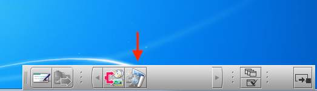
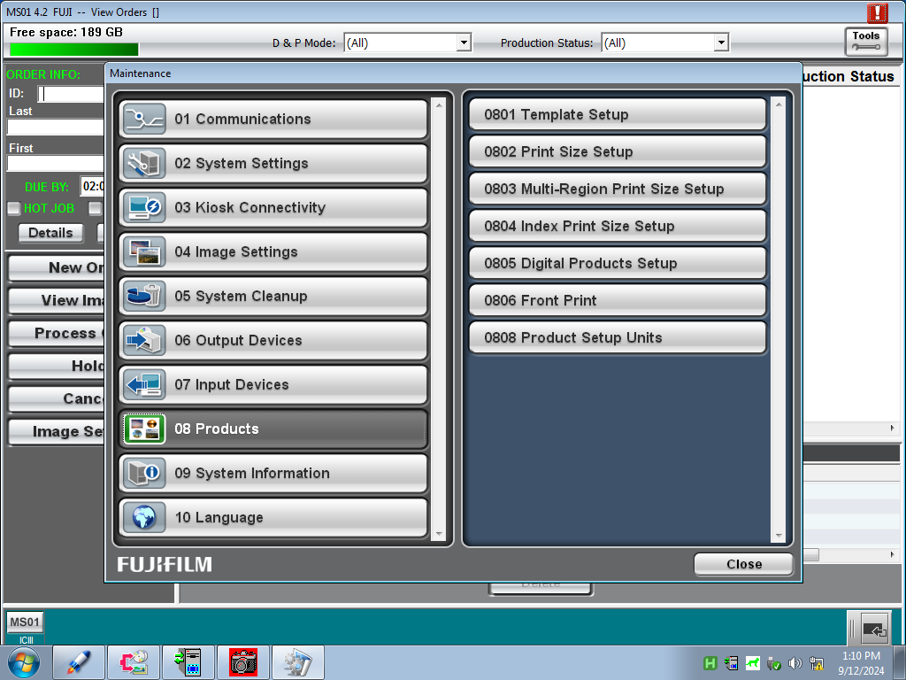
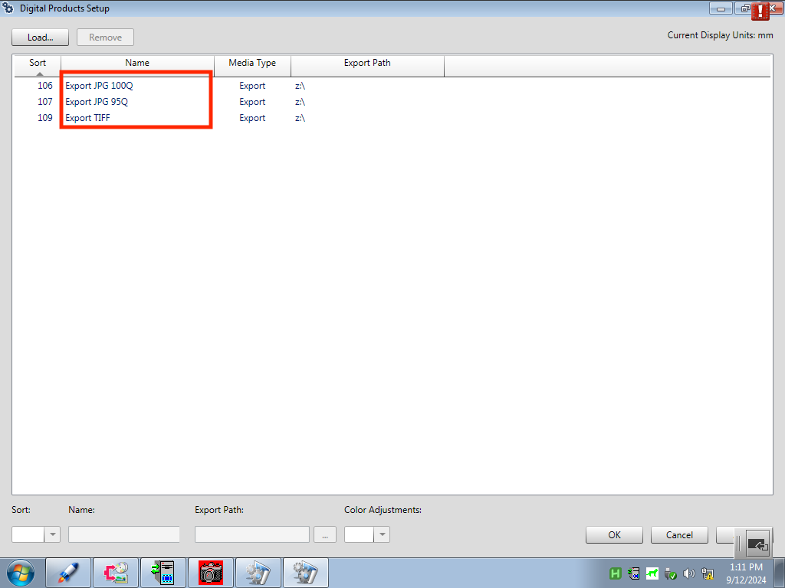

# Frontier MS01 shortcuts
This AutoHotkey script makes exporting scans from the Frontier MS01 server quicker and easier (saves you from clicking 6 times per order).

## Installation
On your MS01 server machine, install [AutoHotkey](https://www.autohotkey.com) (v2) first, and then download the `frontier_ms01_quick_export.ahk` file.

To make the script auto-run on machine startup, move the script to your Startup folder in the Start Menu (press Windows+R and type `shell:startup` and hit Enter).

## Configuration
**IMPORTANT:** You must do this step so the script knows what your "Digital products" export settings are named. To check what export settings you have:

1. Click the **Maintenance** button on the toolbar (usually on the bottom right of the screen).


2. Click **Products > Digital Products Setup**.


3. Remember the list of names listed in the Digital Products Setup screen (shown highlighted in red below).


4. Edit the `frontier_ms01_quick_export.ahk` file, and change the names at the end of the file to match what names you saw in the previous step:
```
+1:: Export("Export JPG 100Q")
+2:: Export("Export JPG 95Q")
+3:: Export("Export TIFF")
```

And so with the above configuration, pressing `Shift+1` will export with `Export JPG 100Q`, `Shift+2` will export with `Export JPG 95Q`, and `Shift+3` will export with `Export TIFF`.

## Use
Double-click the `frontier_ms01_quick_export.ahk` file to run it (or let it auto-run if you did that). Either on the order list screen or on a single order screen, you can press `Shift+1` / `Shift+2` / `Shift+3` to export using that particular export setting as defined in the `.ahk` script.
